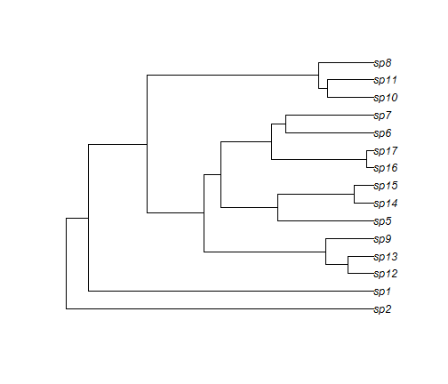

Paralellizing QuaSSE - Options and Approaches
========================================================

From the tutorial, begin with an unparallelized version. 

We’ll start with a simulated tree. The tree simulation differs slightly from the other methods, because
there is no longer a canonical argument list (speciation and extinction rates are arbitrary functions of the
character state). Here is a set of functions; speciation rate is a sigmoidal function which ranges from 0.1
to 0.2 with an inflection point at x = 0, extinction is constant at rate 0.03, and the model of character
evolution is Brownian motion with diffusion parameter 0.025.


```r
# set knitr options
opts_chunk$set(message = FALSE, warning = FALSE)
```


```r
require(diversitree)
lambda <- function(x) sigmoid.x(x, 0.1, 0.2, 0, 2.5)
mu <- function(x) constant.x(x, 0.03)
char <- make.brownian.with.drift(0, 0.025)
```


You can also embed plots, for example:


```r
set.seed(1)
phy <- tree.quasse(c(lambda, mu, char), max.taxa = 15, x0 = 0, single.lineage = FALSE)
plot(phy)
```

  


We need to specify the standard deviation for the states; here I will just assume that all taxa have a state
standard deviation of 1=200


```r
states <- phy$tip.state
states.sd <- 1/200
```


Then, build the likelihood as usual. The difference compared with other models is that we have to specify
the speciation and extinction functions (here, sigmoid.x and constant.x, respectively). There are a
number of other provided functions (see ?constant.x for a list), but any function that takes x as the first
argument may be used.


```r
lik <- make.quasse(phy, states, states.sd, sigmoid.x, constant.x)
```


This can be used in ML calculations as usual. There is a starting.point.quasse function that may
be useful in selecting sensible starting points, but some effort is still required to convert this into a full
vector as it just returns constant rate speciation, extinction, and diffusion rates.


```r
p <- starting.point.quasse(phy, states)
p
```

```
##    lambda        mu diffusion 
##   0.16108   0.02569   0.03164
```


Let’s ignore drift: the argument list we need is:


```r
lik.nodrift <- constrain(lik, drift ~ 0)
argnames(lik.nodrift)
```

```
## [1] "l.y0"      "l.y1"      "l.xmid"    "l.r"       "m.c"       "diffusion"
```


A sensible starting point here might be


```r
p.start <- c(p[1], p[1], mean(states), 1, p[2:3])
names(p.start) <- argnames(lik.nodrift)
p.start
```

```
##      l.y0      l.y1    l.xmid       l.r       m.c diffusion 
##   0.16108   0.16108   0.57097   1.00000   0.02569   0.03164
```

```r

# set lower bound
lower <- c(0, 0, min(states), -Inf, 0, 0)
```


Then run find.mle, as usual. The control argument here just tells the subplex algorithm to use an initial step size of 0.1 (rather than 1), which reduces the number of function evaluations somewhat.


```r
time.f <- system.time(fit <- find.mle(lik.nodrift, p.start, control = list(parscale = 0.1), 
    lower = lower, verbose = 0))
time.f
```

```
##    user  system elapsed 
##   572.0     0.0   564.2
```

```r
fit
```

```
## $par
##      l.y0      l.y1    l.xmid       l.r       m.c diffusion 
## 1.993e-05 2.229e-01 2.583e-01 3.349e+04 4.502e-06 2.894e-02 
## 
## $lnLik
## [1] -51.75
## 
## $counts
## [1] 953
## 
## $convergence
## [1] 0
## 
## $message
## NULL
## 
## $hessian
## NULL
## 
## $method
## [1] "subplex"
## 
## $par.full
##      l.y0      l.y1    l.xmid       l.r       m.c     drift diffusion 
## 1.993e-05 2.229e-01 2.583e-01 3.349e+04 4.502e-06 0.000e+00 2.894e-02 
## 
## $func.class
## [1] "constrained" "quasse"      "dtlik"       "function"   
## 
## attr(,"func")
## QuaSSE likelihood function:
##   * Parameter vector takes 6 elements:
##      - l.y0, l.y1, l.xmid, l.r, m.c, diffusion
##   * Function constrained (original took 7 elements):
##      - drift ~ 0
##   * Function takes arguments (with defaults)
##      - pars: Parameter vector
##      - ...: Additional arguments to underlying function
##      - pars.only [FALSE]: Return full parameter vector?
##   * Phylogeny with 15 tips and 14 nodes
##      - Taxa: sp1, sp2, sp5, sp6, sp7, sp8, sp9, sp10, sp11, ...
##   * Reference:
##      - FitzJohn (2010) doi:10.1093/sysbio/syq053
## R definition:
## function (pars, ..., pars.only = FALSE)  
## attr(,"class")
## [1] "fit.mle.quasse" "fit.mle"
```


*Time of the find.mle function*

Function took 9.4033 minutes to run. Given that the desired use case involves phylogenies of many hundreds of taxa, this is far too long. 

Extracting the likelihood function from Quasse
-----------

Let's look at the function call make.quasse


```r
lik.nodrift
```

```
## QuaSSE likelihood function:
##   * Parameter vector takes 6 elements:
##      - l.y0, l.y1, l.xmid, l.r, m.c, diffusion
##   * Function constrained (original took 7 elements):
##      - drift ~ 0
##   * Function takes arguments (with defaults)
##      - pars: Parameter vector
##      - ...: Additional arguments to underlying function
##      - pars.only [FALSE]: Return full parameter vector?
##   * Phylogeny with 15 tips and 14 nodes
##      - Taxa: sp1, sp2, sp5, sp6, sp7, sp8, sp9, sp10, sp11, ...
##   * Reference:
##      - FitzJohn (2010) doi:10.1093/sysbio/syq053
## R definition:
## function (pars, ..., pars.only = FALSE)
```


The likelihood function is in there, we need to prize it out!

What does the structure of the function look like?


```r
str(lik.nodrift)
```

```
## function (pars, ..., pars.only = FALSE)  
##  - attr(*, "class")= chr [1:4] "constrained" "quasse" "dtlik" "function"
##  - attr(*, "argnames")= chr [1:6] "l.y0" "l.y1" "l.xmid" "l.r" ...
##  - attr(*, "formulae")=List of 1
##   ..$ :Class 'formula' length 3 drift ~ 0
##   .. .. ..- attr(*, ".Environment")=<environment: R_GlobalEnv> 
##  - attr(*, "func")=function (pars, condition.surv = TRUE, root = ROOT.OBS, root.f = NULL, 
##     intermediates = FALSE)  
##   ..- attr(*, "class")= chr [1:3] "quasse" "dtlik" "function"
```

```r
lik.nodrift
```

```
## QuaSSE likelihood function:
##   * Parameter vector takes 6 elements:
##      - l.y0, l.y1, l.xmid, l.r, m.c, diffusion
##   * Function constrained (original took 7 elements):
##      - drift ~ 0
##   * Function takes arguments (with defaults)
##      - pars: Parameter vector
##      - ...: Additional arguments to underlying function
##      - pars.only [FALSE]: Return full parameter vector?
##   * Phylogeny with 15 tips and 14 nodes
##      - Taxa: sp1, sp2, sp5, sp6, sp7, sp8, sp9, sp10, sp11, ...
##   * Reference:
##      - FitzJohn (2010) doi:10.1093/sysbio/syq053
## R definition:
## function (pars, ..., pars.only = FALSE)
```

```r

# provide pars
pars <- c(0.1, 0.2, 0, 2.5, 0.03, 0.01)

lik.nodrift(pars)
```

```
## [1] -62.04
```

```r

# what are these paramters!! in what order??
```


calling lik.nodrift
   - l.y0, l.y1, l.xmid, l.r, m.c, diffusion
  * Function constrained (original took 7 elements):
     - drift ~ 0
     
This would appear to be the the -log liklihood for this tree. We need to find the actually function inside!

Let's try calling a debug (not seen within R markdown)

I see the call

lik(pars)
debugging in: lik(pars)
debug: {
    pars2 <- f.pars(pars)
    ans <- all.branches(pars2, intermediates)
    rootfunc(ans, pars2, condition.surv, root, root.f, intermediates)
}

I don't see any documentation on the functions rootfunc or pars.

Where to go from here
======

1. We can email Rich and ask him to report where the function is actually being held. It has to exist.

2. We can remake the function from the going back to the original paper (antonin?)

3. We can try to code just a new function type, within the find.mle framework, and just ignore where the actual function call is (this seems kinda crazy, but possible, see below)

Treating Quasse as a black box
==============================


```r

# reformat lower bound into the correct syntax
lower <- c(0, 0, 0, 0, 0, 0)

# is there an upper bound?
upper <- c(1, 1, 1, 1, 1, 1)
bounds <- cbind(lower, upper)
rownames(bounds) <- c("l.y0", "l.y1", "l.xmid", "l.r", "m.c", "diffusion")

require(ppso)

result <- optim_pso(objective_function = lik.nodrift, number_of_parameter = 6, 
    parameter_bounds = bounds, initial_estimates = p.start, projectfile = NULL, 
    logfile = "pso.log", tryCall = TRUE, max_number_of_iterations = 20, verbose = 0)


fit
```

$par
     l.y0      l.y1    l.xmid       l.r       m.c diffusion 
1.993e-05 2.229e-01 2.583e-01 3.349e+04 4.502e-06 2.894e-02 

$lnLik
[1] -51.75

$counts
[1] 953

$convergence
[1] 0

$message
NULL

$hessian
NULL

$method
[1] "subplex"

$par.full
     l.y0      l.y1    l.xmid       l.r       m.c     drift diffusion 
1.993e-05 2.229e-01 2.583e-01 3.349e+04 4.502e-06 0.000e+00 2.894e-02 

$func.class
[1] "constrained" "quasse"      "dtlik"       "function"   

attr(,"func")
QuaSSE likelihood function:
  * Parameter vector takes 6 elements:
     - l.y0, l.y1, l.xmid, l.r, m.c, diffusion
  * Function constrained (original took 7 elements):
     - drift ~ 0
  * Function takes arguments (with defaults)
     - pars: Parameter vector
     - ...: Additional arguments to underlying function
     - pars.only [FALSE]: Return full parameter vector?
  * Phylogeny with 15 tips and 14 nodes
     - Taxa: sp1, sp2, sp5, sp6, sp7, sp8, sp9, sp10, sp11, ...
  * Reference:
     - FitzJohn (2010) doi:10.1093/sysbio/syq053
R definition:
function (pars, ..., pars.only = FALSE)  
attr(,"class")
[1] "fit.mle.quasse" "fit.mle"       

```r
result
```

$value
[1] -123.2

$par
     l.y0      l.y1    l.xmid       l.r       m.c diffusion 
   1.0000    1.0000    0.0000    0.4535    0.0000    1.0000 

$function_calls
[1] 800

$break_flag
[1] "max iterations reached"


This fails with the bounds! What are the upper bounds? It fails if i place Inf
